Networking and storage are the two most important components of any virtualization platform. In this post, we will configure networking and storage on our Proxmox server. Although some people will manage [VLAN's](https://en.wikipedia.org/wiki/Virtual_LAN) in Proxmox, I prefer to manage this in my [Unifi Controller](https://ui.com/us/en). This allows me to manage all my network devices in one place. So, this post will focus on how to use Proxmox in a VLAN environment where the Proxmox server and its' VM's have their own VLAN, which is managed by the Unifi Controller.

## Networking

First, let's talk about some networking basics. A VLAN is a virtual LAN that allows you to segment your network into multiple virtual networks. This is useful for a number of reasons, such as security, performance, and scalability. For example, you might want to create a VLAN for your Proxmox server and its' VM's, so they are isolated from the rest of your network. This is useful if you are running a homelab environment and you don't want your lab environment to interfere with your production network.

### Why use VLAN's?

VLAN's are a great way to segment your network. This is especially important in a homelab environment where you may have multiple devices running on the same network. For example, you may have a NAS, a media server, a gaming PC, and a virtualization server all running on the same network. If you don't segment these devices, they can all talk to each other. This is not ideal, as you may not want your gaming PC to have access to your NAS. By using VLAN's, you can segment these devices into different networks, so they can't talk to each other.

Having a VLAN to isolate your lab environment from your "production" home network is a good idea, primarily so you don't see any interruptions in "production".

> **What is "microsegmentation"?**
>
> Microsegmentation is a security technique that enables fine-grained security policies to be assigned to individual workloads, down to the individual workload level. This is in contrast to traditional security models, which apply security policies to entire networks or subnets. Microsegmentation is often used in virtualized environments to provide security at the workload level.
{: .prompt-info}

So, we're NOT quite doing "microsegmentation" here, but instead we're basically carving out one VLAN for our homelab Proxmox environment and then isolating that from the rest of the home network.

### Example VLAN Setup

Here's an example of how you might set up your VLAN's in a homelab environment where users are on VLAN 10, your IoT devices are on VLAN 20, and your Proxmox server and its' VM's are on VLAN 30:

```mermaid
graph LR
    B["🏠Home Network/Unifi
    192.168.1.0/24 (VLAN 0)"]
    B --> Users["👥 Users
    192.168.10.0/24 (VLAN 10)"]
    B --> IoT["🔌IoT Devices
    192.168.20.0/24 (VLAN 20)"]
    B --> ProxMoxServer["☁️ Proxmox
    192.168.30.0/24 (VLAN 30)"]

    ProxMoxServer --> F["🖥️ VM1
    192.168.30.3/24
    (VLAN 30)"]
        ProxMoxServer --> G["🖥️ VM2
    192.168.30.4/24
    (VLAN 30)"]
        ProxMoxServer --> H["🖥️ VM3
    192.168.30.25/24
    (VLAN 30)"]
        ProxMoxServer --> I["🖥️ VM4
    192.168.30.91/24
    (VLAN 30)"]
```



<!-- _includes/mermaid.html -->
<script src="https://cdn.jsdelivr.net/npm/mermaid/dist/mermaid.min.js"></script>
<script>
 //document.addEventListener("DOMContentLoaded", function () {
      const prefersDarkScheme = window.matchMedia("(prefers-color-scheme: dark)").matches;
      const mermaidConfig = {
        startOnLoad: true,
        theme: prefersDarkScheme ? "dark" : "default"
      };
      mermaid.initialize(mermaidConfig);
   // });
</script>

### Unifi VLAN Setup

Not everyone has a Unifi network, so I won't go into great detail here, but the concepts are the same if you do have a similar setup with hardware from a different vendor. Here's a high-level overview of how you might set up VLAN's in a Unifi network:

#### Create VLAN's

When you log into your Unifi controller and go to the "Settings" tab, you can create VLAN's under the "Networks" section. Here you can create a new network and assign it a VLAN ID. You can also assign a network group to the VLAN, which is useful for setting up firewall rules. For example:


It may seem that you'd want to choose "Isolate Network", however that will make it so you can't "see" into that network from your Users network. Instead, you would want to create firewall rules to block traffic between the networks.

> By default, Unifi will **ALLOW** traffic between VLAN's which means you need to specifically create rules that block all the different paths between VLAN's.
>
> The significance here is to **not assume that since you have a VLAN defined, that it is isolated from the rest of your network.** You need to create firewall rules to block traffic between VLAN's.
{: .prompt-warning}

Here's an example of blocking traffic between VLAN's:


### Proxmox Setup

Assuming you have a VLAN setup in your network, you can now configure Proxmox to use that VLAN. Here's how you can do that. Although you might be able to do this in the Proxmox web interface, it can be easy to "lock yourself out" of your server if the network is misconfigured. So, to do this via the command line, you can SSH into your Proxmox server and edit the `/etc/network/interfaces` network configuration file with something like:

```bash
nano /etc/network/interfaces
```

In the end, you need something like this for a VLAN of 50, for example:

```plaintext
auto lo
iface lo inet loopback

iface eno1 inet manual

# This configures the enp3s0 interface for VLAN 50
iface enp3s0.50 inet manual

iface enp3s0 inet manual

auto vmbr0
iface vmbr0 inet static
        address 192.168.50.9/24
        gateway 192.168.50.1
        # NOTE that you should bind the bridge to the .50 physical interface
        bridge-ports enp3s0.50
        bridge-stp off
        bridge-fd 0
        # Make the bridge be VLAN aware
        bridge-vlan-aware yes
        # Support VLAN's between 2-4094
        bridge-vids 2-4094
#VLAN aware. Default: VLAN 50
```

The comment at the end will show in the web interface, like this:


After you've made these changes, you can restart the networking service with:

```bash
systemctl restart networking
```

In the end, if you've configured everything correctly, you should be able to access your Proxmox server on the new VLAN IP address. If you have firewall rules in place, then you can access the VLAN where Proxmox and its' VM's are, but from the context of that Proxmox VLAN, it should look like that's all that is on the network, and you will have internet access.

The significance of this is: imagine if one of your servers were externally exposed and it got compromised. If you have a VLAN setup, then the attacker would only have access to that VLAN and not the rest of your network. The attacker would think (and truly only have access to) the VLAN, and nothing else on your network.

There are many different ways to configure networking with Proxmox including using [Open vSwitch](https://www.openvswitch.org/), [Linux bridges](https://wiki.debian.org/BridgeNetworkConnections), [bonding](https://wiki.debian.org/Bonding) and also Proxmox's built-in [Firewall](https://pve.proxmox.com/wiki/Firewall). I prefer to use Linux bridges as they are simple to configure and work well for my needs. That, coupled with my Unifi VLAN network isolation, that seems like a good fit that isn't too complex.
